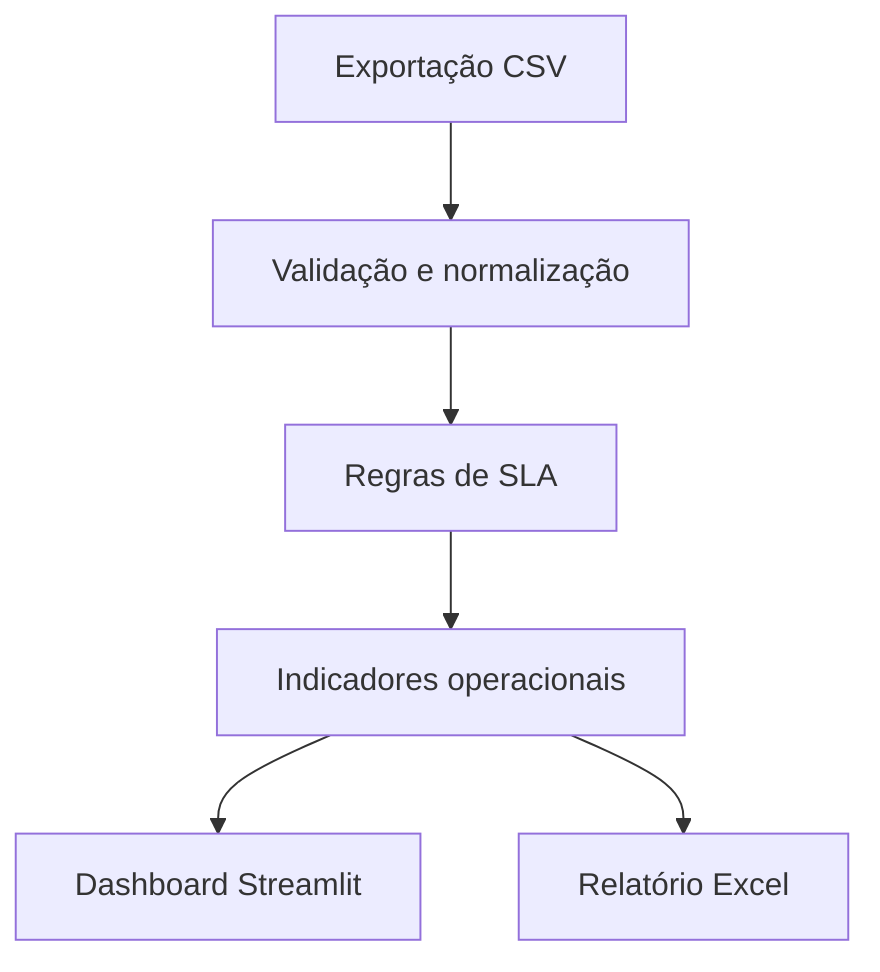

# GLPI Service Desk Analytics with Python

> Aplicação em Python para análise de chamados, acompanhamento de SLA e geração de indicadores operacionais de uma central de serviços.

[](https://www.python.org/)
[](https://pandas.pydata.org/)
[](https://streamlit.io/)
[](https://pytest.org/)
[](LICENSE)

## Visão geral

O projeto transforma uma exportação de chamados em um painel operacional para
acompanhar volume, status, prioridades, categorias, produtividade, tempo de
resposta, tempo de resolução e cumprimento dos acordos de nível de serviço.

A solução foi inspirada em rotinas de suporte e service desk, mas não depende
de uma instalação real do GLPI. Toda a demonstração utiliza dados fictícios e
pode ser executada localmente.

## Problema resolvido

Equipes de suporte precisam identificar rapidamente chamados atrasados,
categorias com maior demanda, gargalos de atendimento e níveis de cumprimento
do SLA. A análise manual de planilhas torna esse acompanhamento demorado e
sujeito a erros.

Este projeto automatiza o tratamento dos dados e entrega indicadores prontos
para análise e tomada de decisão.

## Funcionalidades

- Importação de chamados por CSV
- Dados fictícios prontos para demonstração
- Filtros por status, prioridade, categoria e técnico
- Total de chamados abertos, resolvidos e atrasados
- Taxa de cumprimento do SLA
- Tempo médio de primeira resposta
- Tempo médio de resolução
- Média de satisfação dos usuários
- Indicadores por técnico e categoria
- Validações de qualidade dos dados
- Exportação de relatório Excel com múltiplas abas
- Testes automatizados com Pytest

## Arquitetura



O motor em `src/analytics.py` é independente da interface. Isso permite sua
reutilização em notebooks, APIs, tarefas agendadas ou pipelines de dados.

## Estrutura

```text
.
├── data/
│   └── sample_tickets.csv
├── src/
│   ├── __init__.py
│   └── analytics.py
├── tests/
│   ├── test_analytics.py
│   └── test_app.py
├── .streamlit/
│   └── config.toml
├── app.py
├── requirements.txt
├── .gitignore
├── LICENSE
├── SECURITY.md
└── README.md
```

## Executar no Windows

### 1. Baixe e extraia o projeto

No GitHub, clique em **Code → Download ZIP**. Extraia o arquivo e abra a pasta
`analise-dados-glpi-python-main` no VS Code.

### 2. Abra o terminal na pasta correta

No terminal do VS Code, confira se o caminho termina com o nome do projeto:

```powershell
Get-Location
```

### 3. Crie o ambiente virtual

```powershell
py -m venv .venv
```

### 4. Instale as dependências

```powershell
.\.venv\Scripts\python.exe -m pip install -r requirements.txt
```

### 5. Execute os testes

```powershell
.\.venv\Scripts\python.exe -m pytest
```

### 6. Abra a aplicação

```powershell
.\.venv\Scripts\python.exe -m streamlit run app.py
```

O navegador abrirá em `http://localhost:8501`.

> Na primeira execução, o Streamlit poderá solicitar um e-mail para receber
> novidades. O preenchimento é opcional: pressione **Enter** sem digitar nada
> para continuar. Se o navegador não abrir automaticamente, acesse
> [http://localhost:8501](http://localhost:8501).

## Formato do CSV

| Coluna | Finalidade |
|---|---|
| `ticket_id` | Identificador único do chamado |
| `opened_at` | Data e hora da abertura |
| `first_response_at` | Data e hora da primeira resposta |
| `resolved_at` | Data e hora da resolução |
| `status` | Situação atual do chamado |
| `priority` | Prioridade operacional |
| `category` | Categoria do atendimento |
| `technician` | Técnico responsável |
| `requester_department` | Área solicitante |
| `sla_target_hours` | Prazo total do SLA em horas corridas |
| `satisfaction_score` | Avaliação de 1 a 5 |

## Como o SLA é calculado

O prazo final é calculado somando `sla_target_hours` à data de abertura. Para
chamados resolvidos, a aplicação verifica se `resolved_at` ocorreu até esse
prazo. Chamados ainda abertos são considerados atrasados quando a data de
referência da análise ultrapassa o prazo.

Para manter a demonstração reproduzível, a data de referência é inferida a
partir da data mais recente da base. Em uma integração real, ela pode ser
substituída pela data e hora atuais.

> Nesta versão, o SLA utiliza horas corridas. Calendários de expediente,
> feriados, pausas e regras específicas do GLPI são evoluções planejadas.

## Testes demonstrados

- cálculo dos indicadores gerais;
- identificação de SLA cumprido e descumprido;
- detecção de chamados abertos em atraso;
- agregação por técnico e categoria;
- rejeição de arquivos com estrutura inválida;
- detecção de problemas de qualidade;
- geração do relatório Excel.

## Como apresentar o projeto em uma entrevista

Desenvolvi esta aplicação para transformar exportações de chamados em uma visão
operacional de Service Desk. O fluxo começa com a leitura e validação do CSV,
passa pela normalização das datas e regras de SLA e termina em indicadores,
gráficos, tabelas e um relatório Excel.

Separei o motor analítico da interface para facilitar manutenção e testes. O
Pandas realiza o tratamento e as agregações, o Streamlit entrega a experiência
interativa, o Plotly constrói as visualizações e o Pytest valida as principais
regras de negócio. Com isso, demonstro análise de dados, organização de código,
automação de relatórios e conhecimento de processos de suporte.

### Decisões técnicas

- dados fictícios permitem testar o painel sem expor informações corporativas;
- filtros atualizam todos os indicadores de forma integrada;
- regras de SLA ficam centralizadas em `src/analytics.py`;
- testes cobrem cálculos, validações, relatório e inicialização do dashboard;
- a arquitetura permite futura integração com API, banco de dados ou Power BI.

## Próximas evoluções

- Consumo direto da API REST do GLPI
- Autenticação segura por variáveis de ambiente
- Calendário de horário comercial e feriados
- Previsão de risco de descumprimento do SLA
- Classificação automática de chamados com IA
- Persistência histórica em banco de dados
- Alertas automáticos para chamados críticos
- Integração com Power BI

## Segurança

Não publique exportações reais do GLPI ou chamados com dados pessoais. Tokens,
credenciais e endereços internos devem permanecer em variáveis de ambiente ou
gerenciadores de segredos.

Consulte [SECURITY.md](SECURITY.md).

## Autor

Desenvolvido por [Marcelo](https://github.com/marceloleicam) como projeto de
portfólio em Python, análise de dados, automação, service desk e Business
Intelligence.

## Licença

Uso exclusivo para avaliação e demonstração de portfólio. Consulte [LICENSE](LICENSE).
